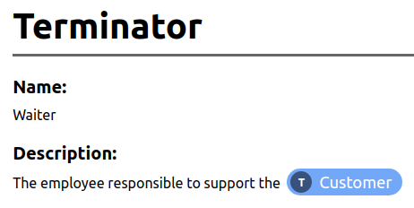

# Project Modeler
Project modeler is a tool for helping you structure your project and have an efficient documentation that any stakeholder can understand. It focus on providing easy to use features in order describe your solution faster and reliable.
The tool mix concepts of system analysis like Data Flow Diagrams (DFD), Entity-Relationship Models (ERM), pseudo-code and other good practices to offer a complete yet maintainable documentation all in a single place.

## Wizard mode
With the wizard mode, the tool will guide you through the basic structure of your project, making it easy to start from scratch.

 1. **Terminators / Actors** 
 The first step is to identify the terminators/actors that will interact with your solution
 2. **Operations**
 Then, we proceed to identify the operations that each Terminator/Actor performs and/or receives
 3. **Entities and properties**
 Moving to the physical model, we start to design our data storage and the properties of each entity
 4. **Payloads**
 Finally, we describe the composition of the data needed and returned by each operation

## Reports
The tool can automatically generate Data Flow Diagrams (DFD) which improves the understanding about the project and helps you identify edge cases

*In the future, I expect to provide many other reports like ERMs and Flowcharts.*

## References
With references, you can simply point to some definition in the project, making the navigation easier and faster

## Pseudo-code (WIP)
Each registered operation can be described using the pseudo-code editor which offers the most used operations while also providing the possibility to describe new actions using an easy-to-use user interface.

## Data dictionary (WIP)
Allows you to define the meaning of the terms used in your project, improving communication between all stakeholders